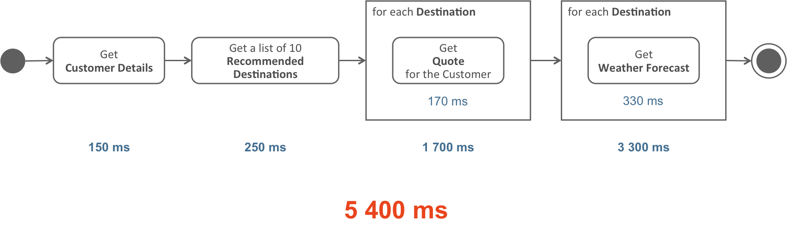

# async-httpclient

This program is used to test the async httpclient by using goroutine, which will both simulate the synchronous and asynchronous ways to embody the pros of async service in go.

## Introduction
To compare the performance between synchronous and asynchronous way in go, we introduce a travel agency whose information system consists of multiple basic services (for more details, see [Reactive JAX-RS Client API](https://jersey.github.io/documentation/latest/rx-client.html#d0e5556))


### Scenario 1 : sync

<br/>



### Scenario 2 : async

<br/>


## Test
```
$ go run main.go
scenario1: synchronous way
5.404077144s
scenario1: asynchronous way
730.744997ms
```

From the running result, we can see that the asynchronous way is more efficient(about 730ms v.s. 5400ms in synchronous way).
