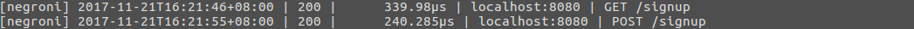

[Negroni]: https://github.com/urfave/negroni

[Mux]: http://www.gorillatoolkit.org/pkg/mux

# cloudgo-io
cloudgo-io is a simple web application that shows the some functions of web service such as static file access, simple JS request support and form processing.

## Usage
Run the server
```
$ go run main.go
[negroni] listening on :8080
```
Open your browser, input certain url for specific service.

For instance:
input `localhost:8080` for the home page (index.html)

## Example
1. static file access

    `localhost:8080/assets`

    

2. simple JS request support

    `localhost:8080`

    

    In hello.js, the client send ajax request to the server for certain `greeting-id` and `greeting-content`, and then append them into the index.html.
    ```javascript
    $(document).ready(function() {
        $.ajax({
            url: "/api/test"
        }).then(function(data) {
           $('.greeting-id').append(data.id);
           $('.greeting-content').append(data.content);
        });
    });
    ```
    In the following screenshot, we can see the `/api/test` request sent by the client.
    

3. form processing

    `localhost:8080/signup`

    We get a HTML page for signup (I have filled the fields here)

    

    Click the submit button.

    We can see the client accept a post request.

    

    Look back the browser, there's a HTML that contains a table of user infomation which we filled just before. (except for the password)

    

4. 501 for url request `/unknown`

    `localhost:8080/unknown`

    
