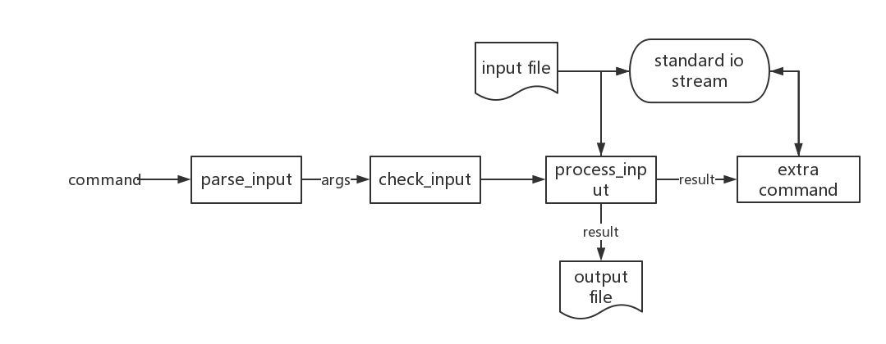

# selpg
selpg is a useful program that extracts a specified range of pages from an input text file.
Here, I implement it by Golang, referring to [开发Linux命令行实用程序](https://www.ibm.com/developerworks/cn/linux/shell/clutil/index.html).

## Usage
```
Usage of selpg: ./selpg -s number -e number [-f | -l number] [-d string] [in_filename]
  -s int
      the start page number to extract an input text(mandatory) (default -1)
  -e int
    	the end page number to extract an input text(mandatory) (default -1)
  -d string
      the destination to output the selected pages
  -f bool
      use form feed to define the pages of an input text file (default false)
  -l int
    	#lines of each page (default 72)
  in_filename string
      the name of the input file
```

## Design Introduction
The selpg program can be divided into three parts:
1. parse the input command-line (implemented in function parse_input)
2. check the validity of the input arguments (implemented in function check_input)
3. process the intput text and extract a specified range of pages (implemented in function process_input)
As shown in the flowchart:


## Packages
To implement this program, I use some handy packages from std-lib:
- flag:    use to parse and obtain the arguments from command-line;
- bufio:   use to read the input text conveniently;
- os/exec: use to execute an extra command if the -f arguments is given.

For the detail implementation, please see the source code.
(It will be easy to read and understand, maybe)

## Examples
Note: the file used to test is a type2 input text file (but we also use it to test the type1 case):
```
$ cat input
line 1 of input file
line 2 of input file
line 3 of input file
line 4 of input file
line 5 of input file
line 6 of input file
line 7 of input file
line 8 of input file
```

1. Input from file:
```
$ ./selpg -s 1 -e 2 -l 2 input
line 1 of input file
line 2 of input file
line 3 of input file
line 4 of input file
selpg: done
```

2. Input from stdin:
```
$ ./selpg -s 1 -e 2 -l 2 < input
line 1 of input file
line 2 of input file
line 3 of input file
line 4 of input file
selpg: done
```

3. Input from the output of other command:
```
$ cat input | ./selpg -s 1 -e 2 -l 2
line 1 of input file
line 2 of input file
line 3 of input file
line 4 of input file
selpg: done
```

4. Save the output into file:
```
$ ./selpg -s 1 -e 2 -l 2 input > output
selpg: done
```
In the output file:
```
line 1 of input file
line 2 of input file
line 3 of input file
line 4 of input file
```

5. Save the error message into file:
```
$ ./selpg -s 3 -e 2 -l 2 input 2> error
```
In the error file:
```
selpg: The end page should be greater than the start page.
Usage of ./selpg:
  -d string
    	the destination to output the selected pages
  -e int
    	the end page number to extract an input text(mandatory) (default -1)
  -f	use form feed to define the pages of an input text
  -l int
    	#lines of each page (default 72)
  -s int
    	the start page number to extract an input text(mandatory) (default -1)
exit status 1
```

6. type2 case(-f is given):
```
$ ./selpg -s 1 -e 2 -f input
line 1 of input file
line 2 of input file
line 3 of input file
line 4 of input file
selpg: done
```

7. excute extra command(its input is the output of selpg):
```
$ ./selpg -s 1 -e 2 -l 2 -d "sort -r" input
selpg: done
line 4 of input file
line 3 of input file
line 2 of input file
line 1 of input file

```

8. Some invalid input cases:
```
$ ./selpg -s 1 -e 2 -l 2 -f input
selpg: Flags -l & -f are mutually exclusive.
Usage of /tmp/go-build700220200/command-line-arguments/_obj/exe/selpg:
  -d string
    	the destination to output the selected pages
  -e int
    	the end page number to extract an input text(mandatory) (default -1)
  -f	use form feed to define the pages of an input text
  -l int
    	#lines of each page (default 72)
  -s int
    	the start page number to extract an input text(mandatory) (default -1)
exit status 1
```

```
$ ./selpg -s -1 -e 2 input
selpg: The start page / end page should be positive integer.
Usage of /tmp/go-build700220200/command-line-arguments/_obj/exe/selpg:
  -d string
    	the destination to output the selected pages
  -e int
    	the end page number to extract an input text(mandatory) (default -1)
  -f	use form feed to define the pages of an input text
  -l int
    	#lines of each page (default 72)
  -s int
    	the start page number to extract an input text(mandatory) (default -1)
exit status 1
```
...
